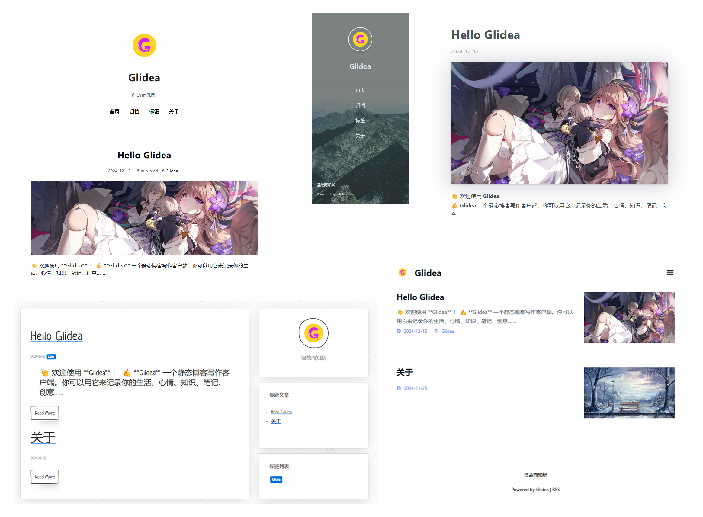
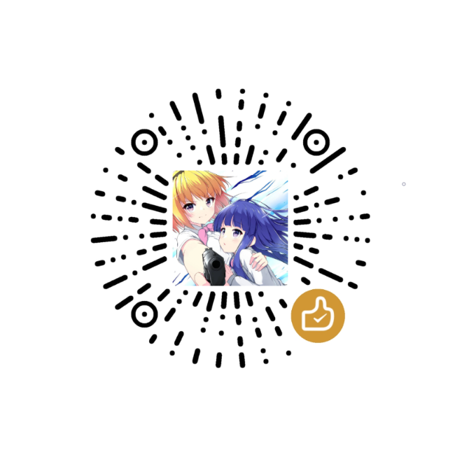

<div align="center">
  
  <h1 align="center">Glidea</h1>
  <h3 align="center">A static blog writing client</h3>

[Download](https://github.com/wonder-light/glidea/releases) | [HomePage](https://glidea.nianian.cn/)

  <a href="https://github.com/wonder-light/glidea/releases/latest">
    
  </a>
  <a href="https://github.com/wonder-light/glidea/blob/master/LICENSE">
    
  </a>
  <a href="https://github.com/wonder-light/glidea/releases/latest">
    
  </a>
</div>

English | [简体中文](README.md)

**[UpdateLog](CHANGELOG.md)** | [License](LICENSE)

👏  Welcome to use **Glidea** ！

✍️  **Glidea** A static blog writing client. You can use it to record your life, mood, and ideas...

# Features👇
📝  Use the coolest **Markdown** editor to create quickly

🌉  Insert pictures and article cover charts anywhere in the article

🏷️  You can group articles by tags

📋  You can customize the menu, you can create an external link menu

💻  You can use this client on a desktop or mobile device

🌎  Use **Github Pages** to show the world that more platforms will be supported in the future

<!--
💬  Simply configure and access the [Gitalk](https://github.com/gitalk/gitalk) or [DisqusJS](https://github.com/SukkaW/DisqusJS) comment system
-->

🗺️  Use **Simplified Chinese**、**English**

🌁  You can use the default theme or any third party theme, has a strong theme customization ability

🖥  You can customize the source folder, using OneDrive, Baidu web disk and other multi-device synchronization

💪 Let us move forward hand in hand to embrace a better future!

# Sample screenshot
<div align="center">
  
</div>

## Development
If you want to contribute code, please check the [Contribution Guide](https://github.com/wonder-light/glidea/wiki/%E8%B4%A1%E7%8C%AE%E6%8C%87%E5%8D%97) in advance

## Start

```shell
# Clone repository Glidea
> git clone https://github.com/wonder-light/glidea.git

# Run the download dependency
> flutter pub get

# Run to start the application
> flutter run
```

## Flutter version
```shell
> flutter --version

Flutter 3.27.3 • channel stable • https://github.com/flutter/flutter.git
Framework • revision c519ee916e (3 days ago) • 2025-01-21 10:32:23 -0800
Engine • revision e672b006cb
Tools • Dart 3.6.1 • DevTools 2.40.2
```
## Build

### Android

Traditional APK

```shell
> flutter build apk
```

AppBundle for Google Play

```shell
> flutter build appbundle
```

### Ios

```shell
> flutter build ipa
```

### MacOS

```shell
> flutter build macos
```

### Windows

Traditional

```shell
> flutter build windows
```

Local MSIX App

```shell
# Install flutter_distributor
> dart pub global activate flutter_distributor

# Build MSIX
> flutter_distributor package --platform windows --targets msix
```

### Linux

Traditional

```shell
> flutter build linux
```

deb

```shell
# Install flutter_distributor
> dart pub global activate flutter_distributor

# Build deb
> flutter_distributor package --platform linux --targets deb
```

---

+ [Flutter environment configuration](https://github.com/toly1994328/FlutterUnit/issues/22)
+ [Flutter collection of utility plug-ins](https://github.com/toly1994328/FlutterUnit/issues/41)

---

## Support


## License
[MIT](LICENSE). Copyright (c) 2024 wonder-light

## Contributors

<a href="https://github.com/wonder-light/glidea/graphs/contributors">
  
</a>