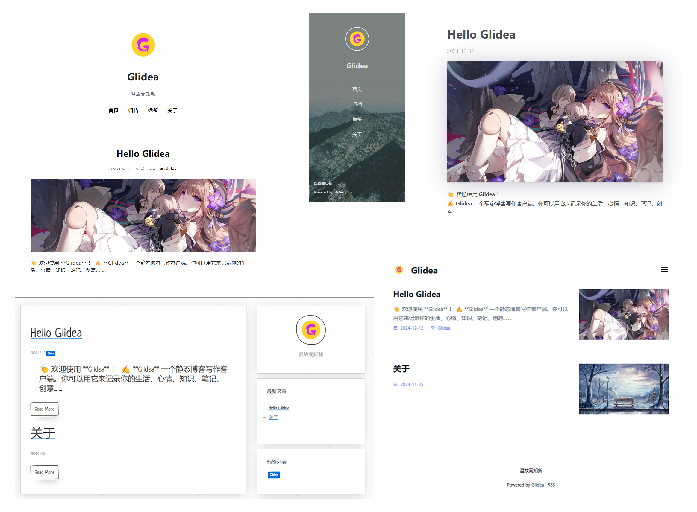

<div align="center">
  
  <h1 align="center">Glidea</h1>
  <h3 align="center">一个静态博客写作客户端</h3>

  [下 载](https://github.com/wonder-light/glidea/releases) | [主 页](https://glidea.nianian.cn/)

  <a href="https://github.com/wonder-light/glidea/releases/latest">
    
  </a>
  <a href="https://github.com/wonder-light/glidea/blob/master/LICENSE">
    
  </a>
  <a href="https://github.com/wonder-light/glidea/releases/latest">
    
  </a>
</div>

[English](README-en.md) | 简体中文

**[更新日志](CHANGELOG.md)** | [LICENSE](LICENSE)

👏  欢迎使用 **Glidea** ！

🔔  **Glidea** 是对 [Gridea](https://github.com/getGlidea/Glidea) 的 flutter 实现, 完全免费开源

✍️  **Glidea** 一个静态博客写作客户端, 可以用来记录你的生活、心情、想法... ...

## 特性👇
📝  你可以使用简洁的 **Markdown** 语法，进行快速创作

🌉  你可以给文章配上精美的封面图和在文章任意位置插入图片

🏷️  你可以对文章进行标签分组

📋  你可以自定义菜单，可以创建外部链接菜单

💻  你可以在桌面端或移动端设备上使用此客户端

🌎  你可以使用 **𝖦𝗂𝗍𝗁𝗎𝖻 𝖯𝖺𝗀𝖾𝗌** 或 **Coding Pages** 向世界展示，未来将支持更多平台

<!--
💬  你可以进行简单的配置，接入 [Gitalk](https://github.com/gitalk/gitalk) 或 [DisqusJS](https://github.com/SukkaW/DisqusJS) 评论系统
-->

🗺️  你可以使用**中文简体**、**英语**等等

🌁  你可以任意使用默认主题或任意第三方主题，有强大的主题自定义能力

🖥  你可以自定义源文件夹，利用 OneDrive、百度网盘等进行多设备同步

🌱 当然 **Glidea** 或许现在还有些许不完美，但请相信，**Glidea** 会不断打磨自己，努力成为你的得力伙伴

💪 让我们一起携手前行，迎接更加美好的未来！

😘 Enjoy the journey with Glidea!

## 开发
如果你想贡献代码，请提前参阅[贡献指南](https://github.com/wonder-light/glidea/wiki/%E8%B4%A1%E7%8C%AE%E6%8C%87%E5%8D%97)

### Flutter 版本
```shell
>> flutter --version
Flutter 3.24.5 • channel stable • https://github.com/flutter/flutter.git
Framework • revision dec2ee5c1f (6 days ago) • 2024-11-13 11:13:06 -0800
Engine • revision a18df97ca5
Tools • Dart 3.5.4 • DevTools 2.37.3
```
### 构建应用

``` shell
>> git clone https://github.com/wonder-light/glidea.git
>> cd glidea

Build Android:
>>  flutter build apk --target-platform --split-per-abi
Build iOS:
>>  flutter build ios
Build Windows:
>>  flutter build windows  
Build Linux:
>>  flutter build linux
```

---

+ [Flutter 环境配置](https://github.com/toly1994328/FlutterUnit/issues/22)
+ [Flutter 实用插件集录](https://github.com/toly1994328/FlutterUnit/issues/41)

---

## 示例截图
<div align="center">
  
</div>

## 支持


## License
[MIT](LICENSE). Copyright (c) 2024 wonder-light
