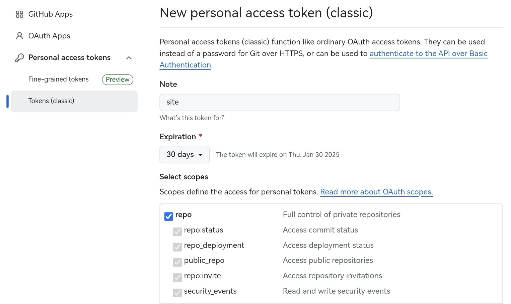
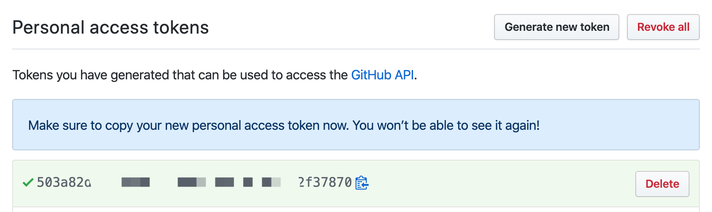
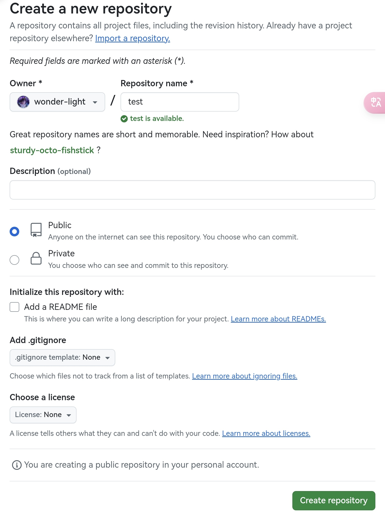

<!-- quick.md -->

# 快速开始 :id=start

> 你好，欢迎开始愉快的 Gridea 之旅呀～

## 安装 :id=install

- 安装 [Glidea](zh-cn/docs/guide/install.md)

## 写作 :id=write

相信你自己可以搞得定哦，加油写作啦！

## 发布 :id=publish

?> Glidea 提供了将博客部署到 GitHub Pages、Coding Pages 和通过 SFTP 的方式上传到自己的服务器的功能。下面将以 GitHub 为例，来讲一下部署流程

1.**创建 GitHub 账号，并创建一个仓库 Token**

  - 点击 [Github](https://github.com/)，进行注册
  - 登录 GitHub 之后，点击[这里](https://github.com/settings/tokens/new)创建一个 Token，**勾选上 repo 的相关权限即可**
  - 生成之后记得把 Token 复制到你的本地，因为一旦关闭网页将不能再看到它

  
  

2.**创建公开仓库，存放构建后的网站文件**
  
  

3.**进入 Glidea 进行远程设置**

  - 按照下图的示例进行设置，然后点击「检测远程链接」，进行配置检查

  

4.**同步**
  
  - 点击 Gridea 中的 同步按钮即可。初次部署等待几分钟之后就可以去浏览器访问了，默认地址为你在第 3 步所填写的域名

 

以上，就完成一个静态博客的搭建了，期待你的每一次落笔成文

🥰